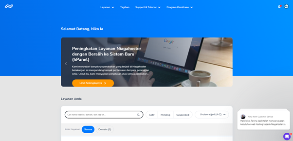
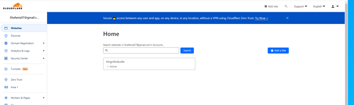
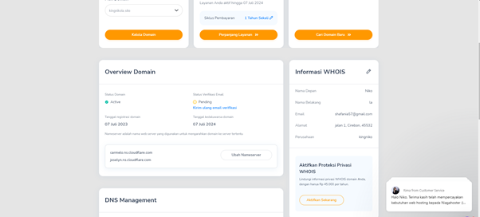
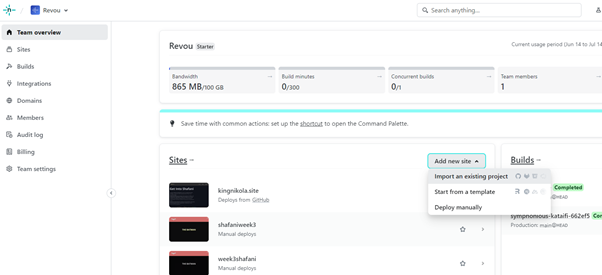
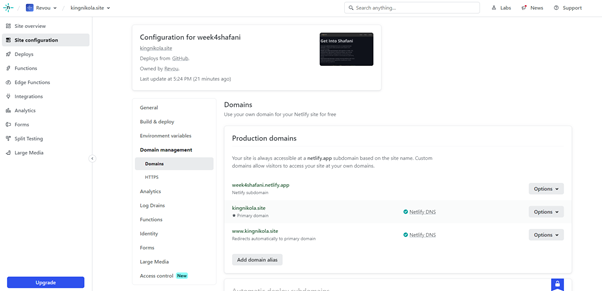

<h1>
   create the branches and committing changes, and Github to make pull requests and merging the codes.
</h1>
<ul>
<li>git init</li>
<li>git remote add origin git@github.com:User/UserRepo.git</li>
<li>git add</li>
<li>git checkout main</li>
<li>git pull origin main </li>
<li>git merge </li>
<li>git commit -m "week4" </li>
<li>git push origin main </li>
</ul>

<h1>Purchasing Domain</h1>
<ul>
  <li>open Niagahoster
login then choose a domain name and buy</li>
  
</ul>
<ul>
  <li>login cloudflare then add domain</li>
   
<ul>
   <li>custom nameserver then wait for verification</li>
   
</ul>
<ul>
   <li>login netlify using github then add site and import existing project</li>
   
</ul>
<ul>
   <li>then add a custom domain, dns settings then wait for verification and the website can be used</li>
   
</ul>
   

<h1>Link Deployment</h1>
<h2><a href="https://kingnikola.site">Sharelinkgan</a></h2>

<h2><a href="https://kingnikola.site">Deployment Klik Di sini</a></h2>

